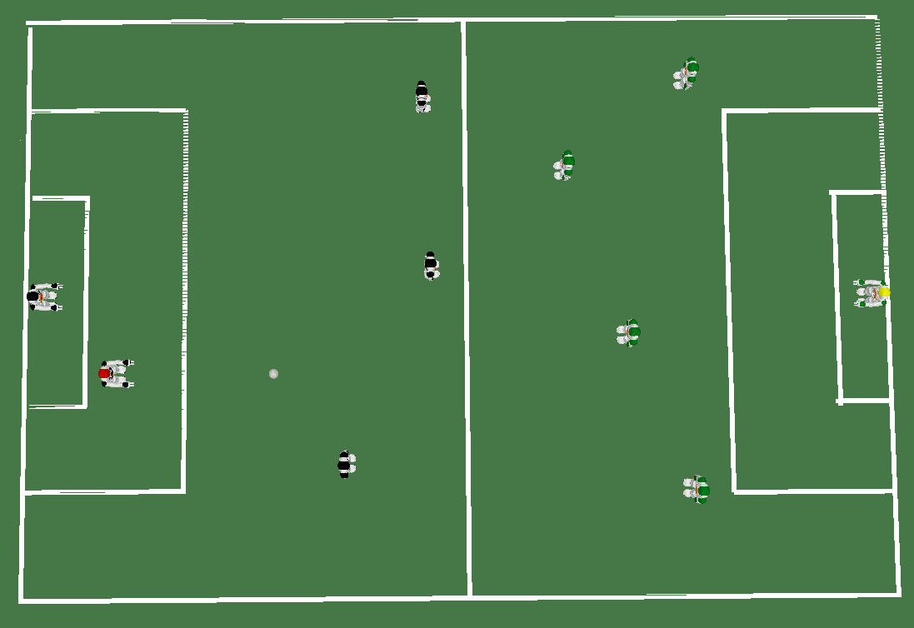
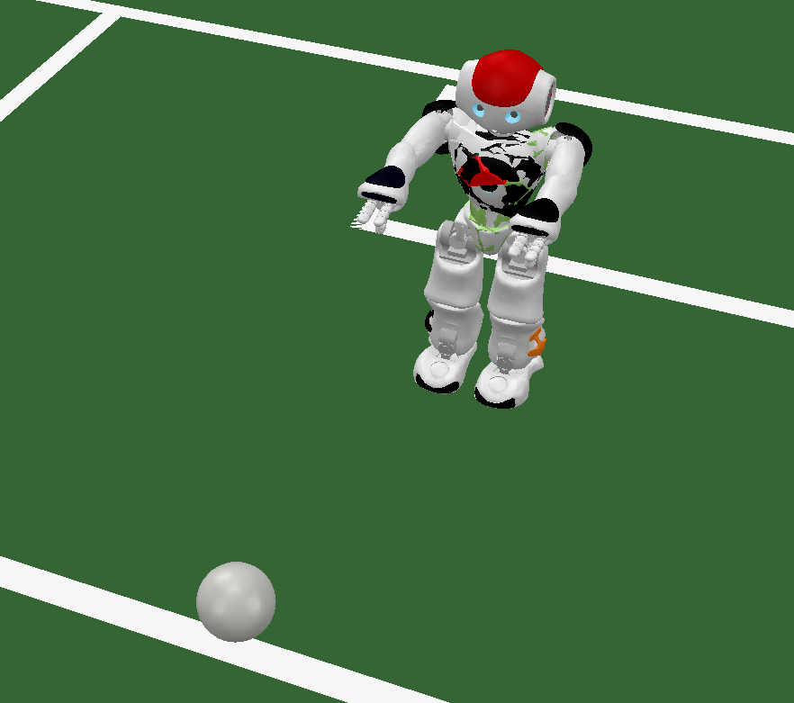
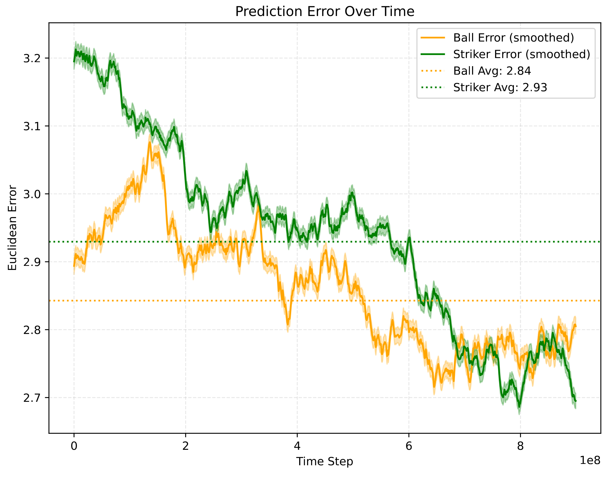
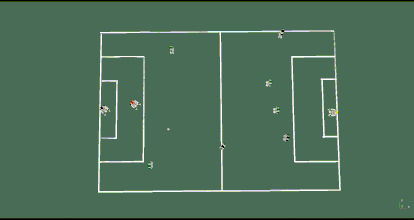
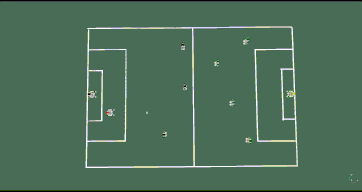
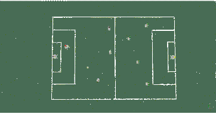
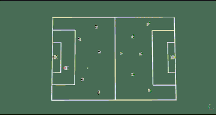

Implementation of causal experiments

# Dribble in the Mind: Exploring Causality with Cognitive Soccer Agents

This repository supports the study **"Dribble in the Mind: Exploring Causality with Cognitive Soccer Agents"**, a project investigating causal reasoning in robotic soccer simulations using a hybrid cognitive architecture. The simulation features a goalkeeper agent attempting to infer the motion of a ball and the intentions of a striker using only partial sensory information.

The code for the work **"Dribble in the Mind: Exploring Causality with Cognitive Soccer Agents"** is present in branch **nao**.

## Setup

Run first the scene present in **scenes** using CoppeliaSim_Edu_V4_3_0_Ubuntu20_04

Then run the java project  **CST_Causality_App**


## 🧠 Project Overview

The project demonstrates a hybrid cognitive architecture that fuses neural perception and symbolic reasoning, built using the **Cognitive Systems Toolkit (CST)** and tested in the **CoppeliaSim** simulation environment. Inspired by **Peircean abductive logic**, the system explores how artificial agents can construct internal models of causality to perform under uncertain and dynamic conditions.

---

## 🏗️ Architecture

<p align="center">

</p>

The system consists of four main layers:

### 1. Sensorial Modules
- Interface with CoppeliaSim via RemoteAPI.
- Collect spatial data (position, orientation, rotation) from the ball, striker, and other agents.

### 2. Perceptual Modules
- Store recent histories (up to 100 frames) of observed objects.
- Enable temporal tracking for motion analysis.

### 3. Semantic Modules
- `Ball Learner` and `Striker Learner`: Linear Data Classifiers trained on historical trajectories.
- Predict future positions based on past movements and context.

### 4. Causal Module
- Aggregates semantic predictions into behavioral abstractions called **"habits"**.
- Infers causal relations to trigger proactive goalkeeper behaviors.

Each component utilizes CST's **idea representation**, a flexible symbolic structure supporting cognitive integration and reasoning.

---

## 🤖 Agents and Simulation Setup

### Environment
- Based on RoboCup SPL specifications.
- Field dimensions: 9000mm x 6000mm.
- Simulated in **CoppeliaSim** with physics-based modeling.

<p align="center">

</p>

### Agents
- **Striker (NAO robot)**: Locates and kicks the ball.
- **Goalkeeper (NAO robot)**: Tracks the ball laterally and infers striker intent through semantic and causal modules.
- **Passive Players**: Randomly placed to simulate occlusions and increase spatial complexity.

<p align="center">

</p>

---

## 🧪 Methodology

### Training Phase
- Goalkeeper is trained in a fixed environment with variable agent positions.
- Physical parameters like ball size and field friction remain constant.
- Five agent instances trained independently for result consistency.

<p align="center">

</p>

### Testing Phase
Three key environmental perturbations were introduced:

1. **Friction Change**  
   - Increased coefficient from 0.3 to 0.5.
   - Tested adaptation to altered field dynamics.

2. **Ball Property Change**  
   - Increased ball mass to 0.5 kg and radius to 20 cm.
   - Evaluated the robustness of physical modeling.

3. **Spatial Complexity Change**  
   - Increased number of passive players from 5 to 7 per team.
   - Tested generalization under occlusion and crowding.

---

## 📈 Results

### Training Results
- Continuous error reduction observed for both striker and ball predictions.
- Ball predictions were more accurate due to deterministic dynamics.
- Striker trajectory exhibited more variance, reflecting higher model complexity.

### Testing Results

| Test Scenario               | Ball Prediction Accuracy | Striker Prediction Accuracy | Notes |
|----------------------------|---------------------------|------------------------------|-------|
| Baseline (training scene)  | High                      | High                         | Good generalization |
| Increased Friction         | Moderate                  | High                         | Overestimates ball range |
| Ball Property Variation    | High                      | High                         | Slight deviation on curves |
| More Passive Players       | High                      | High                         | Slight impact on ball turns |

- The system demonstrated **strong generalization** to novel conditions, particularly in handling agent-driven behaviors (striker).
- Performance decreased slightly for passive dynamics (ball) in changed friction environments.

---

### Reccordings

1. **Train**  

<p align="center">

</p>

2. **Friction Change**  
<p align="center">

</p>

3. **Ball Property Change**  
<p align="center">

</p>

4. **Spatial Complexity Change**  

<p align="center">

</p>

---

### Trained models

Available [here](https://zenodo.org/records/15271940)!

To use the models, create a **/profine** folder in the project root and insert the files in that folder.

---

## 📚 Theoretical Foundations

- **Abductive Reasoning (Peirce)**: Core of the causal module; the system hypothesizes unobserved causes from observed effects.
- **CST Ideas**: Serve as the unifying structure for encoding and reasoning about symbolic and perceptual data.

---

## 🚀 Getting Started

### Requirements
- [CoppeliaSim](https://www.coppeliarobotics.com/)
- Java (Main code)
- Python (for plot scripts)
- Cognitive Systems Toolkit (CST)


### Repository
Clone the repository and change to **nao** branch:

```bash
git clone https://github.com/leolellisr/causality
cd causality
git checkout nao
